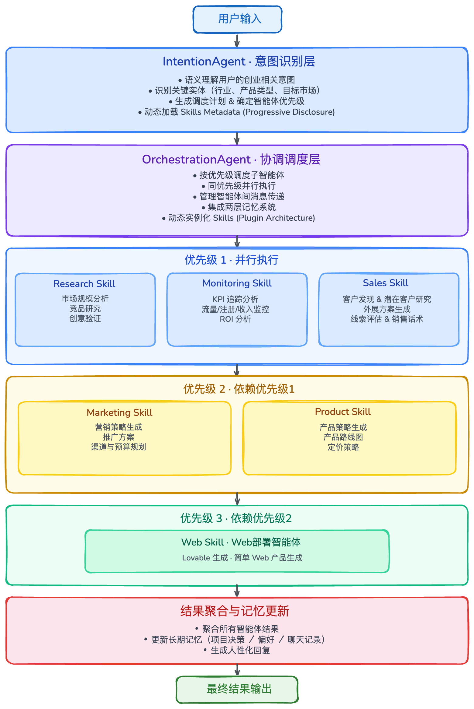

# CEOClaw

基于大模型和**AgentScope框架**的多智能体AI Founder系统，采用Plan-and-Execute架构，实现智能意图识别、两层记忆系统、联网搜索、CEO协调模式和优先级并行调度。

---

## 系统架构



### 连接与可用性

为保证 LLM 服务不稳定时的可用性，在调用链外增加了以下机制（不改变原有业务逻辑）：

| 机制 | 说明 |
|------|------|
| **熔断器** | 连续失败若干次后暂停调用 LLM，直接提示「服务暂时不可用」；一段时间后自动半开试探恢复。 |
| **重试与退避** | 对意图识别、编排两次 LLM 调用做有限次重试，仅对超时、429、5xx 等可重试错误生效，采用指数退避。 |
| **健康检查** | 会话内输入 `health` 可查看熔断状态并探测 LLM 是否可达；命令行执行 `python cli.py health` 可单独做一次探测。 |


---

## 核心功能

### 1. 意图识别（基于LLM语义理解）

系统支持**6大类意图**自动识别：

- **research**: 市场调研与创意验证
  - 示例："帮我调研一下AI教育市场"、"分析一下竞品情况"
- **marketing**: 营销策略生成
  - 示例："制定一个B2B SaaS的营销策略"、"设计推广方案"
- **product**: 产品规划与迭代
  - 示例："做一个产品规划方案"、"帮我设计功能路线图"
- **sales**: 销售执行与客户发现
  - 示例："帮我找一些潜在客户"、"设计销售外展话术"
- **monitoring**: 绩效监控与数据分析
  - 示例："看看最近的数据表现"、"分析一下ROI"
- **web**: Web部署与落地页生成
  - 示例："做一个产品落地页"、"生成一个Web产品"

**意图识别示例**：
```
用户: "帮我调研一下AI教育市场，然后做一个产品方案"
→ IntentionAgent 识别为 research + product
→ Priority 1: 调度 ResearchAgent（市场调研）
→ Priority 2: 调度 ProductAgent（基于调研结果做产品规划）
→ 最终返回调研报告 + 产品规划方案

用户: "制定营销策略，然后做一个落地页"
→ IntentionAgent 识别为 marketing + web
→ Priority 2: 调度 MarketingAgent（营销策略）
→ Priority 3: 调度 WebAgent（基于策略生成落地页）
→ 最终返回营销方案 + Lovable生成url
```

### 2. 两层记忆系统

**短期记忆（会话级）**
- 基于**内存滑动窗口**机制
- 保存最近10轮对话
- 用于上下文理解和消歧

**长期记忆（持久化）**
- **JSON文件持久化存储**：项目偏好、历史决策、完整聊天历史
- **项目偏好管理**：目标市场、技术栈、品牌风格等
- **历史决策记录**：调研结果、策略方案、产品规划，支持跨会话查询
- **统计信息**：常用操作、总决策数
- **LLM异步总结**：自动总结历史会话和项目记录

### 3. CEO协调模式

CEOClaw 采用 **CEO主导的协调模型**，而非让多个智能体直接互相调用：

1. **用户**与CEO Agent交互（IntentionAgent + OrchestrationAgent）
2. **CEO Agent**分配任务给专家智能体
3. **专家智能体**读取当前项目状态，输出结构化报告
4. **CEO Agent**读取报告，决定下一步行动

这种设计的优势：
- 系统更容易控制和调试
- 更接近真实创始人协调不同职能团队的方式
- 每个决策点都可以加入人工审批

### 4. Human-in-the-Loop 决策门控

CEOClaw 的核心原则是并非所有创始人决策都应该完全自动化。在关键时刻：
- 创意验证
- 营销策略采纳
- 产品更新决策
- 敏感销售行动

CEO Agent 可以暂停并请求**人工审批**，保持系统与真实创始人工作流的一致性。

### 5. 优先级并行调度

基于 **asyncio.gather** 的智能并行调度机制：

- **多意图识别**：支持6大类意图
- **三级优先级调度**：
  - **P1 信息收集**（并行）：research、monitoring、sales
  - **P2 策略生成**（依赖P1）：marketing、product
  - **P3 执行部署**（依赖P2）：web
- **动态调度**：根据意图识别结果动态分配优先级

---

## 快速开始

### 1. 安装依赖

```bash
# 使用 requirements.txt 安装所有依赖
pip install -r requirements.txt
```

### 2. 配置模型

编辑 `config.py`，填入API key：

```python
LLM_CONFIG = {
    "api_key": "your-api-key-here",  # 替换为你的API密钥
    "model_name": "deepseek-chat",
    "base_url": "https://api.deepseek.com",
    "temperature": 0.7,
    "max_tokens": 8192,
}
```

### 3. 启动系统

```bash
python cli.py
```

---

## 多智能体系统设计

CEOClaw 由一个中心 **CEO Agent** 协调的**多智能体创始人系统**实现。

系统不直接向用户暴露多个智能体，而是使用**单一的CEO前端层**和多个幕后专家智能体。这保持了交互的连贯性，同时允许系统跨产品、调研、营销、销售、监控和Web执行等领域完成专业化的创始人任务。

### 智能体角色

#### CEO Agent（IntentionAgent + OrchestrationAgent）
CEO Agent 是整个系统的协调器，负责：
- 与用户交互
- 将任务路由到正确的专家智能体
- 收集和汇总报告
- 做出战略建议
- 在关键决策门控处请求人工审批

#### Research Agent（市场调研智能体）
处理所有调研密集型任务：
- 自动化市场调研
- 竞品分析
- 社交聆听
- 创意验证报告

#### Marketing Agent（营销策略智能体）
负责：
- 营销策略生成
- 推广方案设计
- SEO实验设计
- 渠道和预算规划

#### Product Agent（产品规划智能体）
处理产品侧规划：
- 产品策略生成
- 功能规划（MVP优先）
- 产品迭代规划
- 定价、入职、UX优化

#### Sales Agent（销售执行智能体）
负责：
- 客户发现
- 潜在客户研究
- 外展方案生成
- 线索评估与销售支持

#### Monitoring Agent（绩效监控智能体）
追踪和分析业务指标：
- 流量、注册、收入
- ROI和漏斗转化
- 生成监控简报，帮助CEO Agent决定是继续、转向还是更新策略

#### Web Agent（Web部署智能体）
负责Web侧产出物和部署：
- 落地页HTML生成
- 简单Web产品生成
- 部署方案（Vercel/Netlify/GitHub Pages）

---

## 子智能体详解 (Skills)

所有子智能体已重构为 **Skill Plugins**，位于 `.claude/skills/` 目录下，支持动态发现与加载。

### 1. ResearchAgent (市场调研智能体)

- **职责**: 市场调研、竞品分析、创意验证
- **技术**: 基于 Tavily Search 网络搜索 + LLM分析总结
- **输出**: 结构化调研报告（市场规模、竞品格局、趋势、机会）
- **示例**: "帮我调研一下AI教育市场"、"分析一下在线协作工具的竞品"

### 2. MarketingAgent (营销策略智能体)

- **职责**: 营销策略生成、推广方案、SEO实验
- **输出**: 策略方案（目标受众、渠道选择、内容策略、时间线、预算、KPI）
- **特点**: 可整合 ResearchAgent 的调研数据生成更精准的策略
- **示例**: "制定一个B2B SaaS的营销策略"、"设计一个内容营销方案"

### 3. ProductAgent (产品规划智能体)

- **职责**: 产品策略、功能规划、产品迭代、定价
- **输出**: 产品规划（愿景、目标用户、功能列表、路线图、技术栈、定价）
- **特点**: 功能按优先级排序（P0/P1/P2），提供MVP路线图
- **示例**: "做一个产品规划方案"、"帮我设计功能路线图"

### 4. SalesAgent (销售执行智能体)

- **职责**: 客户发现、潜在客户研究、外展方案、线索评估
- **输出**: 目标客户画像、获客渠道、外展话术（邮件模板、电梯演讲）
- **特点**: 基于产品信息和市场数据智能推断目标客户
- **示例**: "帮我找一些潜在客户"、"设计客户外展方案"

### 5. MonitoringAgent (绩效监控智能体)

- **职责**: KPI追踪、数据分析、绩效评估
- **查询内容**: 项目历史决策、偏好设置、业务指标
- **特点**: 基于长期记忆中的历史数据进行分析，需要 MemoryManager
- **示例**: "看看最近的数据表现"、"分析一下ROI"

### 6. WebAgent (Web部署智能体)

- **职责**: 落地页生成、Web产品创建、部署方案
- **输出**: 完整HTML代码 + 部署建议（平台选择、部署说明）
- **特点**: 可整合 ProductAgent/MarketingAgent 的方案生成对应的Web产出物
- **示例**: "做一个产品落地页"、"生成一个SaaS着陆页"

---

## 工作流层级分配

### 创业层 (Startup Layer)
- **CEO Agent**: 启动、创意生成、验证决策
- **Research Agent**: 自动化调研
- **Web Agent**: 生成Web产品和落地页
- **Product Agent**: 产品规格支持（可选）

### 运营策略层 (Operations Strategy Layer)

**营销策略**
- **Marketing Agent**: 营销策略生成
- **Marketing Agent + Research Agent**: 虚拟测试与市场调研
- **CEO Agent**: 采纳/拒绝策略决策
- **Web Agent**: 部署营销相关Web资产

**绩效监控**
- **Monitoring Agent**: 追踪指标与数据分析
- **CEO Agent**: 基于绩效信号的战略决策

**产品迭代**
- **Product Agent**: 生成产品策略
- **Product Agent + Research Agent**: 虚拟测试
- **CEO Agent**: 产品更新决策
- **Web Agent**: 部署更新后的产品资产

### 执行层 (Execution Layer)
- **Sales Agent**: 客户发现、客户外展、销售执行
- **Research Agent**: 潜在客户和市场调研支持（可选）
- **CEO Agent**: 敏感操作的审批与升级

---

## CLI 使用指南

### 启动

```bash
python cli.py
```

### 内置命令

| 命令 | 说明 |
|------|------|
| `help` | 显示帮助信息 |
| `status` | 查看当前状态和记忆 |
| `health` | 检查 LLM 服务是否可用并显示熔断器状态 |
| `clear` | 清空当前任务（保留长期记忆） |
| `history` | 查看历史决策记录 |
| `preferences` | 查看项目偏好设置 |
| `exit` | 退出程序 |

单独做健康检查（不进入交互）：`python cli.py health`，返回 `OK` / `FAIL: ...`，退出码 0/1。

---

## 测试

### 集成测试 (QA)
完整跑通所有意图和子智能体的端到端测试：
```bash
python tests/test_cli_qa.py
```

### 单元测试
针对各个核心模块的测试：

```bash
python tests/test_intention_agent.py  # 意图识别
python tests/test_orchestration.py    # 协调系统
```

---

## 项目结构

```
CEOCLAW/
├── agents/                          # 核心编排层（CEO Agent）
│   ├── intention_agent.py           # 意图识别（CEO决策层）
│   ├── orchestration_agent.py       # 协调器（CEO调度层）
│   └── lazy_agent_registry.py       # 智能体插件注册器（懒加载）
├── .claude/skills/                  # Skill Plugins (专家智能体)
│   ├── research/                    # 市场调研 Skill
│   │   ├── script/agent.py          # ResearchAgent
│   │   └── SKILL.md                 # 技能定义
│   ├── marketing/                   # 营销策略 Skill
│   │   ├── script/agent.py          # MarketingAgent
│   │   └── SKILL.md
│   ├── product/                     # 产品规划 Skill
│   │   ├── script/agent.py          # ProductAgent
│   │   └── SKILL.md
│   ├── sales/                       # 销售执行 Skill
│   │   ├── script/agent.py          # SalesAgent
│   │   └── SKILL.md
│   ├── monitoring/                  # 绩效监控 Skill
│   │   ├── script/agent.py          # MonitoringAgent
│   │   └── SKILL.md
│   └── web/                         # Web部署 Skill
│       ├── script/agent.py          # WebAgent
│       └── SKILL.md
├── context/                         # 两层记忆系统
│   ├── memory_manager.py            # 记忆管理器（统一API）
│   ├── short_term_memory.py         # 短期记忆（会话级滑动窗口）
│   └── long_term_memory.py          # 长期记忆（JSON持久化）
├── data/
│   └── memory/                      # 长期记忆JSON存储（user_id.json）
├── tests/                           # 测试脚本
│   ├── test_cli_qa.py               # 端到端集成测试
│   ├── test_intention_agent.py      # 意图识别测试
│   └── test_orchestration.py        # 协调系统测试
├── utils/                           # 工具与连接可用性
│   ├── circuit_breaker.py           # 熔断器
│   ├── llm_resilience.py            # 重试退避、健康检查
│   ├── json_parser.py               # JSON 鲁棒解析（6层容错）
│   └── skill_loader.py              # Skill 加载器
├── assets/                          # 架构图
│   ├── CEOCLAW.drawio.png           # 系统架构图
│   └── CEOCLAW.svg
├── cli.py                           # CLI 主程序
├── config.py                        # 配置文件（LLM/系统/韧性）
├── config_agentscope.py             # AgentScope 初始化
├── CLAUDE.md                        # Claude Code 指引
├── requirements.txt                 # Python 依赖
└── README.md                        # 本文件
```


## 未来规划

- [ ] PostgreSQL持久化存储
- [ ] Redis缓存层
- [ ] 完整的Human-in-the-Loop审批流程
- [ ] 真实业务数据监控接入（Google Analytics、Stripe等）
- [ ] Web界面（FastAPI + React）
- [ ] 更多Skill插件（社交媒体管理、邮件自动化等）

---

